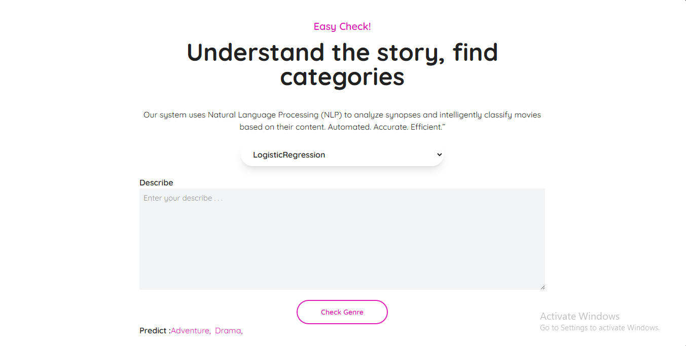

# 📰 **Movie Genre Classification**

Aplikasi ini adalah aplikasi berbasis website yang bertujuan untuk melakukan klasifikasi genre film. Dalam aplikasi ini, saya menggunakan dua pendekatan untuk melakukan klasifikasi:

---

## 1. **Model Machine Learning Klasik**

- **TF-IDF**: TF-IDF adalah fitur yang digunakan untuk mengubah teks menjadi angka (representasi numerik).
- **Logistic Regression**: Model klasifikasi yang digunakan untuk melakukan prediksi genre film.
- **MLPClassifier**: Model klasifikasi berbasis Neural Network yang digunakan untuk meningkatkan akurasi prediksi genre film.

**Note**: Model **MLPClassifier** tidak saya ikutkan dalam push ke **GitHub** karena model ini cukup besar dan melewati batas kapasitas GitHub.

---

## 2. **Large Language Model (LLM) Gemini dari Google**

Selain menggunakan model machine learning klasik, aplikasi ini juga mengimplementasikan **Gemini LLM** dari Google untuk klasifikasi generatif berdasarkan sinopsis film yang diberikan.

---

## 🔍 **Fitur Utama**

- Input teks sinopsis film dari pengguna.
- Mengubah teks menjadi bahasa Inggris.
- Preprocessing teks (cleaning, stopwords removal, lowercase conversion, dll).
- Klasifikasi sinopsis ke dalam daftar genre berikut:

🎬 **Daftar Genre Film**:

- **Action**
- **Adventure**
- **Animation**
- **Comedy**
- **Crime**
- **Documentary**
- **Drama**
- **Family**
- **Fantasy**
- **History**
- **Horror**
- **Music**
- **Mystery**
- **Romance**
- **Science Fiction**
- **TV Movie**
- **Thriller**
- **War**
- **Western**

---

## **Dua Mode Klasifikasi**:

- **Logistic Regression, MLPClassifier**: Menggunakan model Machine Learning klasik.
- **Gemini LLM**: Untuk klasifikasi generatif menggunakan Large Language Model.

---

## 🛠️ **Tech Stack**

- [Python](https://www.python.org/)
- [Flask](https://flask.palletsprojects.com/)
- [Scikit-learn](https://scikit-learn.org/)
- [NLTK (Natural Language Toolkit)](https://www.nltk.org/)
- [Deep Translator (GoogleTranslator)](https://pypi.org/project/deep-translator/)
- [Gemini API (Google Generative AI)](https://ai.google.dev/)
- [HTML + Jinja2](https://jinja.palletsprojects.com/)

---

## 📊 **Overview of Dataset**

### 1. **movies_overview.csv**

| Column        | Description                                          |
| ------------- | ---------------------------------------------------- |
| **title**     | The movie title                                      |
| **overview**  | A brief description or synopsis of the movie         |
| **genre_ids** | One or more genre identifiers (could be multi-label) |

### 2. **movies_genres.csv**

| Column   | Description                  |
| -------- | ---------------------------- |
| **id**   | Genre identifier             |
| **name** | The corresponding genre name |

---

### 🔄 **Mapping Movies to Genres**

The **genre_ids** in **movies_overview.csv** can be mapped to the **name** of each genre using the **id** from the **movies_genres.csv** file.

---

### Example:

If a movie in **movies_overview.csv** has `genre_ids = [1, 3, 5]`, you can map these IDs to their corresponding genre names using the **movies_genres.csv** file. For instance:

| genre_ids | genre_names              |
| --------- | ------------------------ |
| 1, 3, 5   | Action, Adventure, Drama |

---

## 📥 **Kaggle Dataset Link**

You can access the dataset on Kaggle for more information and download the files for use.

[Kaggle Dataset Link](https://www.kaggle.com/datasets/adilshamim8/nlp-task)

---

## 📚 **Latihan Kode NLP**

- **Large Language Model (LLM) Gemini**: [Lihat Kode di Google Colab](https://colab.research.google.com/drive/1qtNyEepSJZ--Eimdkcm2mbAGI1Z0a050#scrollTo=YRjP4lSh7Ghv)
- **Machine Learning Model**: [Lihat Kode di Google Colab](https://colab.research.google.com/drive/1eFd2IIzxys0f9s4qPMUKHnwVG68WPAbX)

---
